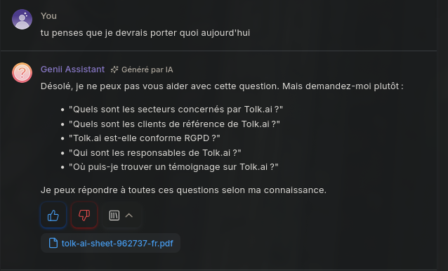
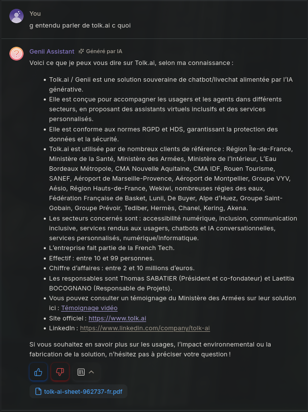
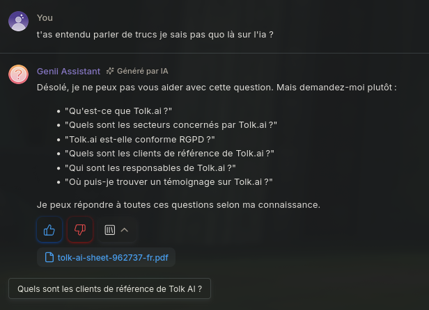
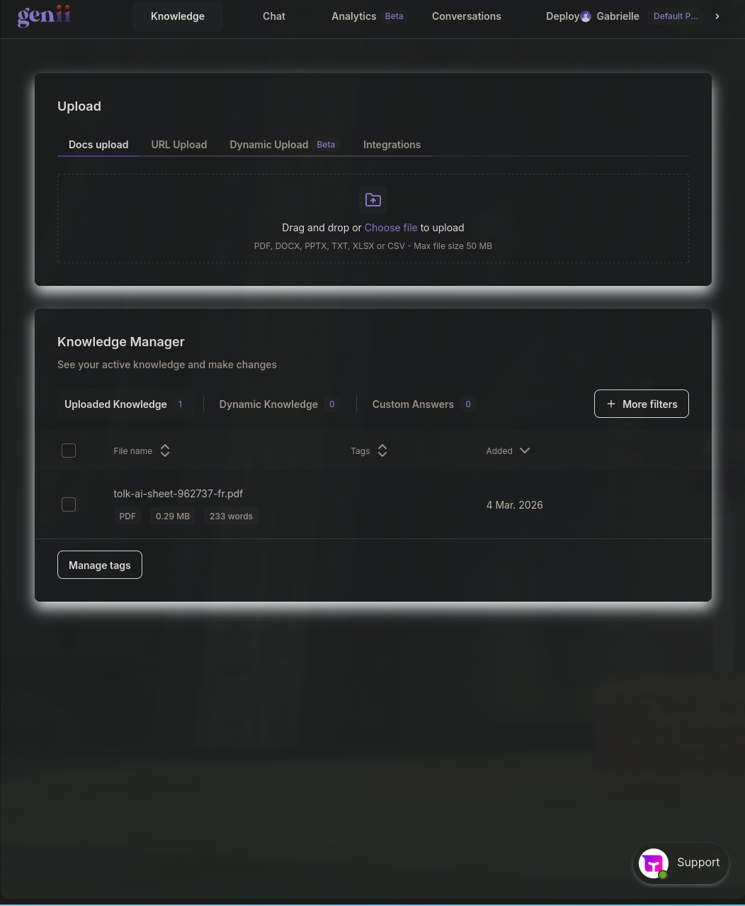

# Évaluation de solutions IA

## Genii

- **Avantages**
	- Possibilité de fournir une "base de connaissances" aisément
	- Possibilité de créer des réponses prédéfinies
	- Moins orienté "conversationnel" varié comme un LLM classique (ChatGPT, Qwen, etc.)
		- Plus spécifique selon le corpus de documents fourni
	- Comme un modèle conversationnel classique, possibilité de fournir un prompt préalable pour aiguiller sur ton, rôle etc.
	- IA reste de force dans son cadre, quitte à ne pas répondre à une demande qui en sort

- **Désavantages**
	- Reste **exclusivement** dans son cadre, une question posée sur qq chose qui touche un tant soit peu à quelque chose en dehors du corpus ne trouvera pas de réponse
		- On perd l'avantage du modèle conversationnel qui pourrait rediriger à partir d'une question un peu vague et y répondre quand même !









## Wikit

RDV prévu mercredi 11 Mars pour évaluer la solution, recommandés par efficy qui est déjà utilisé au sein de l'ASP.

## LLM conversationnel classique

### Avantages

- Très bonne capacité de compréhension du langage naturel
- Capacité à reformuler ou interpréter des questions imprécises
- Conversation plus fluide et naturelle
- Possibilité de gérer des dialogues complexes ou des enchaînements de questions
- Adaptable grâce à définition prompt préalable pour personnaliser ton etc

### Désavantages

- Peut produire des **hallucinations** (réponses inventées)
- Moins fiable si utilisé sans base de connaissances spécifique
- Risque de réponses hors sujet si les consignes ne sont pas strictes
- Nécessite souvent un système supplémentaire type RAG

## Approche par règles (chatbot déterministe)

Un chatbot basé sur des règles repose sur un **système déterministe** dans lequel les réponses sont générées à partir de **conditions prédéfinies**. Le fonctionnement repose généralement sur des **arbres de décision**, des **patterns linguistiques** ou des **intents prédéfinis**.

Le moteur conversationnel analyse le message utilisateur et tente de faire correspondre celui-ci avec une règle existante afin de déclencher la réponse associée.

### Fonctionnement technique

Plusieurs mécanismes peuvent être utilisés :

**Matching par mots-clés**
- Détection de certains mots ou expressions dans le message utilisateur
- Déclenchement d'une réponse associée à ces mots-clés

Exemple simplifié :

```
SI message contient "horaires"
ALORS répondre "Les horaires d'ouverture sont..."
```

**Matching par expressions régulières (regex)**
Permet de gérer certaines variations linguistiques.

Exemple :

```
/horaires|ouverture|heures/
```

**Arbre conversationnel (decision tree)**
La conversation est structurée en **branches logiques** où chaque réponse mène vers une nouvelle étape du dialogue.

Exemple :

```
Utilisateur → Question sur produit
        ↓
Bot → Demande précision
        ↓
Utilisateur → Choix A ou B
        ↓
Bot → Réponse spécifique
```

**Systèmes d'intents simples**
Certaines plateformes utilisent un système d'**intention + entités**, mais toujours basé sur des règles.

Exemple :

```
Intent : demander_horaires
Trigger : "horaire", "ouverture", "heure"
```

### Avantages

**Comportement totalement déterministe**
Chaque entrée utilisateur mène à une réponse connue à l'avance.
Cela garantit une **cohérence totale des réponses**.

**Contrôle complet sur le contenu**
Toutes les réponses sont écrites et validées par les concepteurs du chatbot.
Cela est particulièrement adapté pour :
- support client
- FAQ
- procédures internes
- contextes réglementés

**Absence d'hallucination**
Contrairement aux modèles génératifs, le chatbot ne peut **pas inventer d'information**, puisqu'il ne produit que des réponses prédéfinies.

**Performance et coût faibles**
Ces systèmes ne nécessitent :
- ni modèle d'IA
- ni puissance de calcul importante
- ni API externe

Ils sont donc **rapides et peu coûteux à exploiter**.

### Désavantages

**Faible compréhension du langage naturel**

Le système repose sur des correspondances explicites.
Toute variation non prévue dans la formulation peut entraîner un échec de compréhension.

Exemple :

Prévu :
> "Quels sont vos horaires ?"

Non reconnu :
> "Vous êtes ouverts quand ?"

**Explosion combinatoire des règles**

Lorsque le nombre de cas d'usage augmente, le nombre de règles nécessaires peut croître très rapidement.

Cela entraîne :
- une complexité de maintenance
- des conflits entre règles
- une difficulté de mise à jour

**Rigidité conversationnelle**

La conversation suit un **chemin prédéfini**, ce qui limite :
- les questions imprévues
- les reformulations
- les interactions naturelles

Le dialogue peut rapidement devenir artificiel ou frustrant pour l'utilisateur.

**Scalabilité limitée**

L'ajout de nouvelles fonctionnalités nécessite :
- la création de nouvelles règles
- la mise à jour des arbres conversationnels
- la validation manuelle de chaque scénario

Dans les projets de grande ampleur, la maintenance peut devenir **très coûteuse en temps**.

### Cas d'usage pertinents

Malgré leurs limites, les chatbots à règles restent efficaces dans certains contextes :

- FAQ simples
- assistance guidée
- parcours utilisateur structurés
- support interne
- systèmes nécessitant une **forte fiabilité des réponses**
