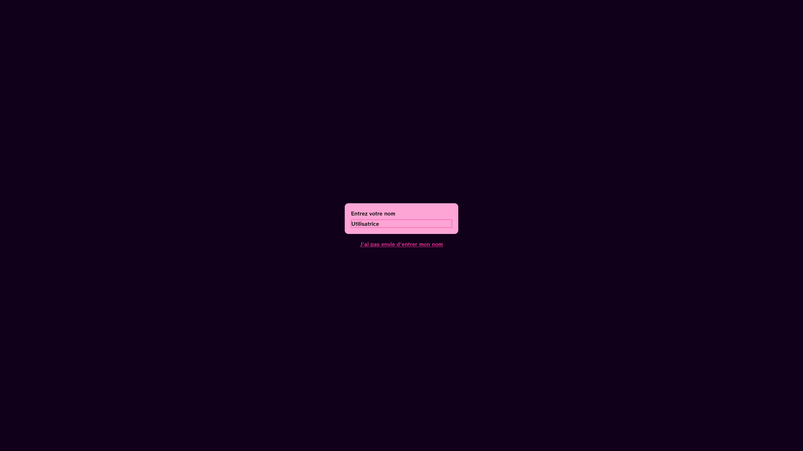
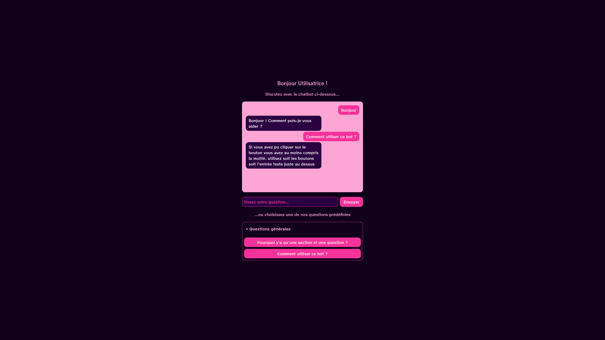

# Chatbot déterministe

## Technologies utilisées

Nous utiliserons ici le langage Rust pour le backend, en utilisant
principalement le module [axum](https://docs.rs/axum/latest/axum/) qui fera ici
office de serveur HTTP pour afficher les pages HTML ainsi que les interactions
nécessitant une certaine logique, comme poser une question au bot. Le frontend
est développé en [HTMX](https://htmx.org/), qui permet notamment d'aisément
envoyer des requêtes HTTP directement depuis du HTML et utilise
[Tailwind CSS](https://tailwindcss.com/) afin de pouvoir rapidement prototyper
une interface convenable.

## Comment marche-t-il ?

Le bot fonctionne d'une manière relativement simple. Lorsque l'utilisateur pose
une question, celui-ci cherche d'abord dans les questions prédéfinies voir si
celle-ci en fait partie dans le but de récupérer la réponse prédéfinie associée
; c'est essentiellement le cas des questions associées aux boutons qui sont
directement récupérées depuis la base de connaissances les contenant. Si le
programme ne trouve pas de question prédéfinie, alors celui-ci cherche si un mot
contenu dans la question est présent dans une liste de déclencheurs pouvant
déclencher telle ou telle réponse. L'ordre de priorité est donc défini par
l'ordre dans lequel les questions sont insérées dans le fichier JSON les
contenant.

## Implémentations

### Premier jet

Voici à quoi ressemble le prototype non fonctionnel du bot, avant de lui donner
la FAQ à "manger".

<figure markdown="span">
  { width="300" align=left }
  { width="300" align=left }
  <figcaption>Les images sont, bien heureusement, cliquables.</figcaption>
</figure>

L'algorithme de sélection actuel, peu développé, ressemble à ceci.

```rust
pub fn trouver_reponse(message: &str, data: &ResponsesData) -> String {
    for section in &data.sections {
        for question in &section.questions {
            if message.to_lowercase() == question.bouton.to_lowercase() {
                return question.reponse.clone();
            }
        }
    }

    for libre in &data.reponses_libres {
        for declencheur in &libre.declencheurs {
            if message.to_lowercase().contains(&declencheur.to_lowercase()) {
                return libre.reponse.clone();
            }
        }
    }

    "Je ne peux pas répondre à cette question.".to_string()
}
```
Nous pouvons en ressortir que l'implémentation actuelle est insatisfaisante ; nous nous trouvons davantage face à une FAQ dont seuls les boutons permettent d'avoir une réponse rapidement.
Les cas où le chatbot répond "librement" restent relativement limités.

### Implémentation finale

Nous avons implémenté une solution de traçage des performances et de journalisation avec `tracing`. Cette solution s'intègre avec des outils tels que la crate `log`, `tracing-opentelemetry`, `tracy`, qui garantissent une bonne intégration avec des outils de déploiement tels que `Prometheus` ou `Grafana`.
La sortie du programme pourrait ressembler à ceci :
```bash

[2026-03-18T14:38:46Z INFO  tracing::span] Chargement des réponses depuis le fichier Json;
[2026-03-18T14:38:46Z TRACE tracing::span::active] -> Chargement des réponses depuis le fichier Json;
[2026-03-18T14:38:46Z TRACE tracing::span::active] <- Chargement des réponses depuis le fichier Json;
[2026-03-18T14:38:46Z TRACE tracing::span] -- Chargement des réponses depuis le fichier Json;
Serveur lancé sur http://localhost:3000
[2026-03-18T14:38:50Z TRACE axum::serve] connection 127.0.0.1:54216 accepted
[2026-03-18T14:38:55Z INFO  tracing::span] Génération et envoi de la réponse vers le front;
[2026-03-18T14:38:55Z TRACE tracing::span::active] -> Génération et envoi de la réponse vers le front;
[2026-03-18T14:38:55Z INFO  tracing::span] Recherche d'une réponse adaptée;
[2026-03-18T14:38:55Z TRACE tracing::span::active] -> Recherche d'une réponse adaptée;
[2026-03-18T14:38:55Z TRACE tracing::span::active] <- Recherche d'une réponse adaptée;
[2026-03-18T14:38:55Z TRACE tracing::span] -- Recherche d'une réponse adaptée;
[2026-03-18T14:38:55Z TRACE tracing::span::active] <- Génération et envoi de la réponse vers le front;
[2026-03-18T14:38:55Z TRACE tracing::span] -- Génération et envoi de la réponse vers le front;
```

Le code est également optimisé pour éviter au maximum de cloner des valeurs en mémoire et utilise `RwLock` pour éviter les courses à l'écriture entre threads. Quant à l'algorithme de "réponse", il a été modifié pour se baser sur un système interne de "score", en attribuant des points à certaines propositions de réponse. Cela nous donne le code suivant :
```rust

fn trouver_reponse(
        &self,
        message: &str,
        derniere_question: &RwLock<Option<String>>,
    ) -> Option<String> {
        let msg = message.to_lowercase();
        let span = span!(Level::INFO, "Recherche d'une réponse adaptée");
        let _guard = span.enter();

        if ["hein", "quoi", "comment", "pas compris"]
            .iter()
            .any(|w| msg.contains(w))
            && let Some(q) = derniere_question.read().unwrap().as_ref()
        {
            return Some(format!("Je pensais que vous demandiez : \"{q}\""));
        }

        let mut best_score = 0;
        let mut best_answer: Option<&String> = None;
        let mut best_question: Option<&String> = None;

        for section in &self.responses.sections {
            for question in &section.questions {
                let mut score = 0;

                let message_mots = nettoyer(message);
                let question_mots = nettoyer(&question.bouton);

                for mot in message_mots {
                    if question_mots.contains(&mot) {
                        score += 1;
                    }
                }

                if score > best_score {
                    best_score = score;
                    best_answer = Some(&question.reponse);
                    best_question = Some(&question.bouton);
                }
            }
        }

        if best_score >= 2 {
            *derniere_question.write().unwrap() = best_question.cloned();
            return best_answer.cloned();
        }
        None
    }
```
Comme nous pouvons le constater, nous avons "généralisé" le code effectuant la tâche susmentionnée en utilisant un `trait`, soit une sorte d'interface propre au Rust. Cela nous permet ainsi d'implémenter plusieurs structures dont la logique de recherche de réponses seront différentes, tout en respectant le principe d'extensibilité ; nous pourrions comparer cette approche avec, notamment, le pattern dit "builder".
